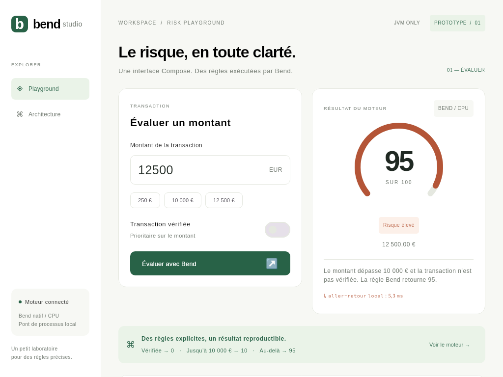

# Bend Studio

Un prototype **Compose Multiplatform avec une seule cible JVM**, relié à un vrai moteur de règles **Bend 2.0.29**, compilé en exécutable natif CPU. Interface française, évaluation asynchrone, saisie décimale exacte, historique en mémoire et page Architecture.



## Lancer ici

```bash
./run.sh
```

Java et Bend sont déjà installés localement dans `.tools/`. Le lancement vérifie les preuves et compile le moteur si nécessaire. La fenêtre démarre avec une vraie évaluation de 12 500 €.

Sur une nouvelle machine Linux x86_64 avec `curl`, `tar`, `sha256sum` et `clang` (14+) :

```bash
./scripts/setup.sh
./run.sh
```

Le bootstrap télécharge des versions fixes de Temurin 21 et Bend, vérifie leurs SHA-256 et n'utilise ni sudo ni modification de configuration système. Gradle 8.14.3 est fourni via le wrapper avec vérification SHA-256. Kotlin 2.2.21, Compose 1.9.3. Aucun SDK Android, cible native Kotlin, serveur Web ou service distant n'est nécessaire. Le premier build nécessite Internet pour les dépendances ; les calculs sont ensuite entièrement locaux.

Sur macOS ou Linux ARM, le bootstrap automatique n'est pas prévu : fournir JDK 21 (`JAVA_HOME`) et Bend 2.0.29 (`PATH`), ainsi que Clang. Le prototype a été exécuté et testé sur Linux x86_64. Windows natif n'est pas pris en charge par ce backend Bend.

## Architecture

```text
Compose Desktop (JVM)
    │ montant validé → centimes exacts + statut vérifié
    ▼ coroutine Dispatchers.IO
RiskEngine / ProcessBuilder (arguments, sans shell)
    │ ./risk-engine --threads 1 -- 1250000 0
    ▼
Exécutable CPU compilé par Bend → C → Clang
    │ BEND_RISK_V1:95
    ▼
Validation du protocole → état Compose → affichage
```

Le moteur n'est jamais simulé : Kotlin ne contient aucun calcul du score. Un nouveau processus est créé par évaluation ; le temps affiché mesure **l'aller-retour, démarrage du processus compris**, pas le temps du calcul seul. Ce choix rend l'intégration facile à examiner et évite de dépendre d'une ABI interne du C généré. Il ne s'agit pas d'un pont JNI ni d'une bibliothèque `.so` exportée automatiquement par Bend.

Le pont limite l'attente à 5 secondes et la sortie à 4 Kio, contrôle le code de sortie et le format exact de réponse, et arrête le processus en cas d'annulation. Une erreur ne produit jamais un score de secours. Le chemin du moteur peut être fourni via la propriété JVM `bend.engine.path`, puis la variable `BEND_ENGINE_PATH`, puis `build/bend/risk-engine`. La tâche Gradle `run` fournit un chemin absolu.

## Règles de démonstration

| Transaction | Score Bend |
| --- | ---: |
| Vérifiée, quel que soit le montant | 0 |
| Non vérifiée, montant ≤ 10 000 € | 10 |
| Non vérifiée, montant > 10 000 € | 95 |

La saisie accepte une virgule ou un point, jusqu'à deux décimales et des espaces de groupement. Les montants négatifs, vides, trop précis ou supérieurs à **42 949 672,95 €** sont refusés. Les centimes utilisent l'intervalle `U32` de Bend, sans flottants. Le statut vérifié est une entrée manuelle de démonstration, pas une vérification d'identité.

Les cinq dernières évaluations sont affichées ; vingt sont conservées en mémoire au maximum. Aucune persistance. Le bouton Effacer vide l'historique de la session.

## Preuves et tests

```bash
./run.sh jvmTest          # moteur réel, pont et parcours UI Compose
./run.sh verifyBend       # les six lois : All terms check.
./run.sh buildBend        # compile build/bend/risk-engine
build/bend/risk-engine -- 1000001 0
# BEND_RISK_V1:95
```

Les tests UI nécessitent une session graphique (ou Xvfb). Les tests du moteur seul : `./run.sh jvmTest --tests fr.bendcompose.RiskEngineTest`.

- `backend/risk_engine.bend` : règles pures, seule source du calcul.
- `backend/LAWS.bend` : priorité du statut vérifié, scores 10/95, borne à 100, seuil exact et premier centime au-dessus.
- `backend/PROOF.bend` : preuves vérifiées avant chaque build du moteur.
- `backend/main.bend` : entrée/sortie CLI versionnée.
- `src/jvmMain/kotlin/fr/bendcompose/RiskEngine.kt` : validation et pont de processus.
- `src/jvmMain/kotlin/fr/bendcompose/App.kt` : interface Compose.
- `src/jvmTest/` : tests de frontières, protocole, panne, timeout, annulation et parcours UI avec le moteur réel.

Les preuves portent sur **les propriétés explicitement déclarées des fonctions pures**. Elles ne constituent pas une certification globale de l'application, du compilateur, du pont ou du système. L'exemple est un moteur déterministe à règles fixes ; il n'intègre aucun agent IA. Ce calcul minuscule s'exécute sur un seul thread CPU ; aucun gain GPU n'est revendiqué.

## Références vérifiées

- [Guide officiel Bend 2](https://github.com/bendlang/bend/blob/main/guide/GUIDE.md) : syntaxe, lois, preuves, IO et compilation native `bend file.bend -o executable`.
- [Bend : limitations et différences avec Bend 1](https://github.com/bendlang/bend#limitations).
- [Compatibilité Compose Multiplatform](https://kotlinlang.org/docs/multiplatform/compose-compatibility-and-versioning.html).

La syntaxe du brief correspondait à Bend 1 ; les sources de ce prototype utilisent Bend 2. Le C émis par Bend n'est pas, à lui seul, une API JNI stable. Une future intégration JNI demanderait un adaptateur et une gestion explicite du runtime ; le pont retenu ici fonctionne avec les outils documentés.
